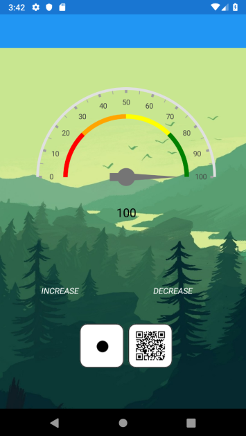

# ELU lauamängu maailmalõpukell
Tellijad: Triinu Jesmin, Jaanus Terasmaa 
Tarnijad: Andreas Malleus, Daniel Golubkov, Robin Rannavete, Martin Tšerdantsev 

Projekti eesmärk on  ELU projekti maailmalõpu lauamängule maailmalõpukella rakendus arendada.  
Rakenduses saab kella väärtust muuta, mängukaarte skaneerida ja tagastatud väärtuse järgi kaarte andmebaasist võtta.  
Andmebaasist võetud kaarte kuvatakse ekraanil ja nende väärtus lisatakse kellale juurde.  
Iga kord kui kella väärtus jagub 5-ga, võetakse vastav kaart andmebaasist. Kui kell liigub üles, võetakse positiivse mõjuga kaart, kui alla, negatiivse mõjuga kaart. 

* Rakendus on loodud <b>tarkvara praktika</b> ja <b>ELU-Lauamängu</b> projketi raames.

* Rakenduse pilt: 

Kasutatud tehnoloogiad: 
* Visual Studio 2019 Community Edition 
* Xamarin.Forms v4.0 
* NETStandard teek v2.0 
* Syncfusion.Xamarin Community Edition v17.1 
* SQLite-net v1.5 
* ZXing.Net.Mobile v2.4 
* Plugin.Permissions v3.0 

Projekti panustasid: 
1. Andreas Malleus - arendaja, tiimijuht, lõpuleviija <b> (viide: https://github.com/Andreasmalleus) </b> 
2. Daniel Golubkov - arendaja, koodi disainer <b> (viide: https://github.com/dangol9) </b> 
3. Robin Rannavete - arendaja, lõpuleviija <b> (viide: https://github.com/RobamaBinBombin) </b> 
4. Martin Tšerdantsev - arendaja, kliendiga suhtleja, testija <b> (viide: https://github.com/iamcatcus) </b> 

Kliendid: 
* Jaanus Terasmaa - Loodus- ja terviseteaduste instituut - Ökoloogia keskuse juhataja, klient ja kontaktisik - tarnis mängukaartide infomratsiooni faili Google Sheets-is <b> (viide: https://www.tlu.ee/inimesed/jaanus-terasmaa) </b> 
* Triinu Jesmin - Digitehnoloogiate instituut - andmeanalüüsi lektor, klient ja kontaktisik <b> (viide: https://www.tlu.ee/inimesed/triinu-jesmin) </b> 

Arenduskeskkonna ülesseadmine:  
Paigaldada Visual Studio 2019 ja lisada laienduse "Mobile Development with .NET". 
Android SDK Manager-is allalaadida Android SDK-d projekti API tasemega (minimaalne API - 18; soovitatav - 28).  
Seadistada Android Virtual Device Manager-is virtuaalne seade rakenduse silumiseks, või lubada USB kaudne silumine oma seadmel ning ühendada seda arvutiga ja panna debugger-i käima. 

Dokumendid (20.06.2019): 
<b> Viide paigaldusjuhisele: https://github.com/dangol9/summer_project/tree/master/Install_Juhend <b/> 
<b> Viide testimisdokumentile: <b> https://github.com/dangol9/summer_project/tree/master/App_Testing <b/> 
<b> Viide dokumentatsioonile: <b> https://github.com/dangol9/summer_project/tree/master/Documentation <b/> 
 
Teised failid: 
<b> Viide APK-le: https://github.com/dangol9/summer_project/tree/master/Install_Juhend <b/> 
